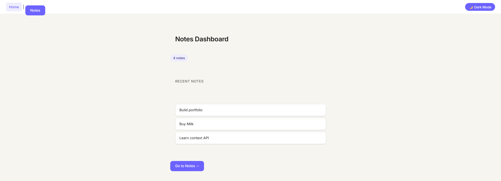
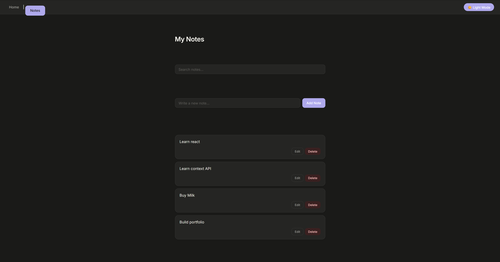
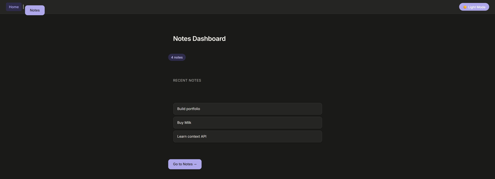
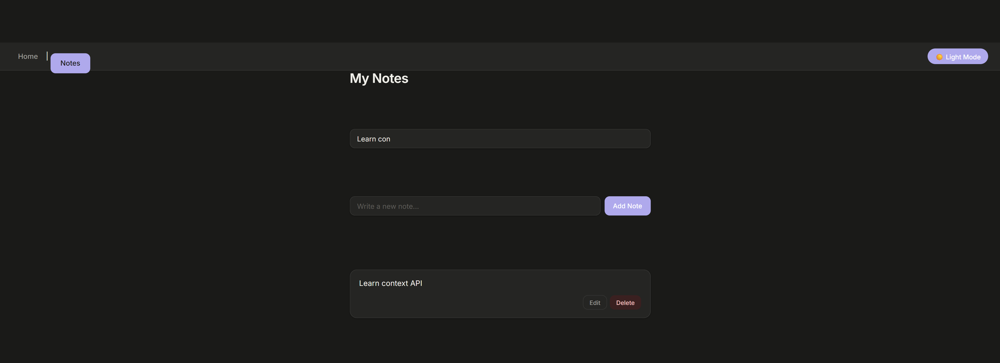

# 📝 Notes App

A modern Notes Management Application built with React. Users can create, edit, delete, search, and manage notes with persistent storage and dark mode support.

## 🚀 Features

* ✅ Create Notes
* ✅ Edit Existing Notes
* ✅ Delete Notes
* ✅ Search Notes Instantly
* ✅ Dark Mode / Light Mode
* ✅ Dashboard with Notes Summary
* ✅ Recent Notes Section
* ✅ Data Persistence using Local Storage
* ✅ Client-Side Routing with React Router
* ✅ Global State Management using Context API

## 📸 Screenshots

## 📸 Screenshots

### Dashboard



### Notes Page



### Dark Mode



### Search Feature



## 🛠️ Tech Stack

* React
* React Router DOM
* Context API
* JavaScript (ES6+)
* CSS3
* Local Storage

## 📂 Project Structure

src/
├── Components/
│ ├── AddNote.jsx
│ ├── NoteItem.jsx
│ └── NotesList.jsx
│
├── Context/
│ └── NotesContext.jsx
│
├── Pages/
│ ├── Home.jsx
│ └── Notes.jsx
│
├── App.jsx
└── main.jsx

## 🎯 Key Concepts Implemented

* React Hooks (`useState`, `useEffect`, `useContext`)
* Context API
* CRUD Operations
* React Router Navigation
* Local Storage Integration
* Controlled Components
* Conditional Rendering
* Search Filtering
* Theme Switching

## ⚙️ Installation

Clone the repository:

```bash
git clone https://github.com/your-username/notes-app.git
```

Navigate to the project folder:

```bash
cd notes-app
```

Install dependencies:

```bash
npm install
```

Run the development server:

```bash
npm run dev
```

## 🌟 Future Improvements

* User Authentication
* Cloud Database Integration
* Categories & Tags
* Note Pinning
* Rich Text Editor
* Note Export Feature

## 👨‍💻 Author

Developed by Keshav

## 📄 License

This project is open-source and available under the MIT License.

## 🌐 Live Demo

[https://notes-app-radhe.vercel.app](https://note-app-keshav89.vercel.app/)

## 📂 Repository

[https://github.com/radhe123/notes-app](https://github.com/CodewithMe89/NoteApp)
